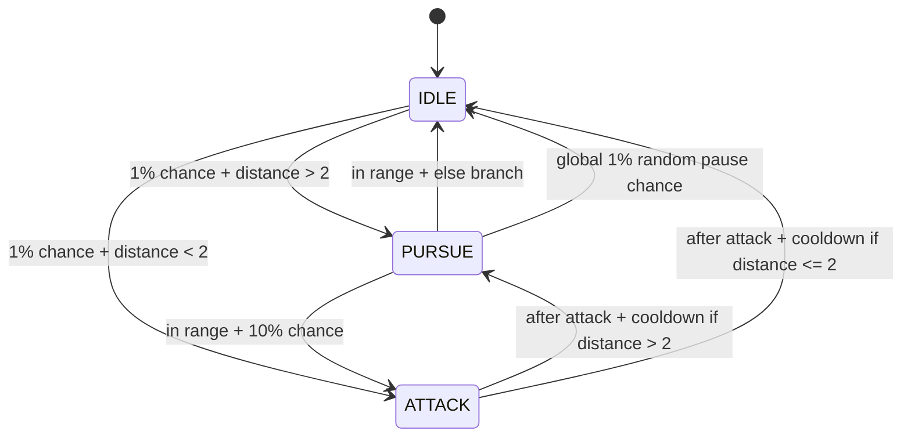

# Enemy AI — State Machine

This document explains how each enemy thinks, moves, reacts to hits, and dies.

---

## Overview

Each enemy runs a **Finite State Machine (FSM)**. At any given moment, the enemy is in exactly one state. Each state controls what the enemy does — whether that is standing around, chasing the player, attacking, or reacting to a hit.

The system is split across three separate responsibilities:

| Class | Responsibility |
|---|---|
| `enemyHealth` | Owns HP. Detects hits. Fires damage events. |
| `AI` | Owns state transitions. Decides when and how to switch states. |
| `Hurt` / `Idle` / `Pursue` / `Attack` | Each state controls its own behavior while active. |

These three layers do not cross into each other's jobs. Health never switches states. States never subtract HP.

---

## The Four States

```
IDLE  ──►  PURSUE  ──►  ATTACK
  ▲                        │
  └────────────────────────┘
         (any state)
              │
              ▼
            HURT
              │
              ▼
        IDLE  or  DEATH
```

### Idle

The enemy stands still and waits.

Every frame there is a small random chance it decides to do something. If the player is within 3 units, it occasionally jumps straight to Attack. If the player is further away, it may start Pursuing.

```
Each frame, one of these can happen:
  - 1% chance  → start Pursuing  (only if player is far away)
  - 10% chance → start Attacking (only if player is within 3 units)
  - Otherwise  → keep waiting
```

A short cooldown timer runs between deciding and actually switching state, so the transition feels less mechanical.

---

### Pursue

The enemy walks toward the player using Unity's **NavMesh**.

To avoid recalculating the path every single frame (which would be expensive), the path is only recalculated every **0.5 seconds**. The enemy navigates through the closest available checkpoint on the way to the player.

Once the player is within 3 units of the enemy:

```
- 20% chance → switch to Attack
- 80% chance → return to Idle
```

There is also a **1% random chance per frame** to give up and return to Idle regardless of distance. This makes the enemy feel slightly less robotic.

---

### Attack

The enemy plays its attack animation and holds position briefly.

```
1. Trigger the "Attack" animation immediately.
2. Wait for the attack timer to finish  (set by attackDuration in the Inspector).
3. Decide what to do next:
   - If the player is more than 3 units away → go to Pursue
   - If the player is close                 → return to Idle
4. Wait a short random cooldown before actually switching.
```

**Damage during Attack is not ignored — it is buffered.** The hit will be processed as a Hurt reaction as soon as the attack finishes. The attack itself is never interrupted mid-swing.

---

### Hurt

The enemy reacts to taking damage.

```
1. Stop all movement.
2. Trigger the "IsHurt" animation exactly once.
3. Wait for the hurt reaction timer.
4. Either:
   a. Return to Idle          (non-lethal hit)
   b. Notify AI that a lethal reaction just finished → death is finalized
```

Hurt does not know anything about health. It only knows how long the reaction should last and whether the hit that caused it was lethal.

---

## State Lifecycle

Every state follows the same three-phase lifecycle, defined in the base `State` class:

```
ENTER  →  UPDATE  →  EXIT
```

- **Enter** runs once when the state begins. Used for setup — resetting timers, stopping movement, triggering one-time animation flags.
- **Update** runs every frame while the state is active. This is where all the main behavior lives.
- **Exit** runs once when the state is about to hand control to the next state. Used for cleanup — resetting animation triggers, restoring movement.

The `AI` MonoBehaviour calls `Process()` on the current state every frame:

```csharp
// Inside AI.Update()
currentState = currentState.Process();
```

`Process()` handles the three phases automatically and returns either `this` (same state continues) or `nextState` (transition to a new state).

---

## Damage and Interruption

Here is exactly what happens step by step when the player hits an enemy.

### Step 1 — Health detects the hit

`enemyHealth` uses a physics trigger to detect when a `damageDealer` collider enters the enemy's hitbox.

```csharp
void OnTriggerEnter(Collider other)
{
    if (other.TryGetComponent<damageDealer>(out var dealer))
    {
        receiveDamage(dealer.damage);
    }
}
```

### Step 2 — Health calculates the result

```csharp
public void receiveDamage(float dmgAmount)
{
    if (health <= 0f) return;       // already dead, ignore

    health -= dmgAmount;
    bool isLethal = health <= 0f;

    // Pack all hit information into one object
    EnemyDamagePayload payload = new EnemyDamagePayload(
        amount:        dmgAmount,
        hurtDuration:  defaultHurtDuration,
        isLethal:      isLethal
    );

    OnDamageReceived?.Invoke(payload);  // tell AI what happened

    if (isLethal)
    {
        pendingDeathFinalization = true; // wait for Hurt to finish before dying
    }
}
```

Health does not call `Death()` directly. If the hit is lethal, it sets a flag and waits. Death is only finalized after the Hurt reaction plays out.

### Step 3 — AI receives the damage event

`AI` subscribes to the damage event when the enemy becomes active, and unsubscribes when it is disabled. The unsubscribe-then-subscribe pattern prevents duplicate listeners when pooled enemies re-enable.

```csharp
void OnEnable()
{
    health.OnDamageReceived -= HandleDamageReceived;
    health.OnDamageReceived += HandleDamageReceived;
}

void OnDisable()
{
    health.OnDamageReceived -= HandleDamageReceived;
}
```

The callback does not switch states immediately. It only stores the hit for later:

```csharp
private void HandleDamageReceived(EnemyDamagePayload payload)
{
    pendingDamage          = payload;
    hasPendingDamage       = true;
    hasPendingLethalDamage = payload.IsLethal;
}
```

### Step 4 — AI applies the interrupt rule

Every frame, after the current state runs, AI checks whether the buffered hit can now be processed:

```csharp
private bool CanConsumePendingDamage()
{
    if (currentState.name == State.STATE.ATTACK) return false; // never interrupt attack
    if (currentState.name == State.STATE.HURT)   return false; // already reacting

    return currentState.name == State.STATE.IDLE
        || currentState.name == State.STATE.PURSUE;
}
```

| Current state | What happens to incoming damage |
|---|---|
| Idle | Hurt begins immediately |
| Pursue | Hurt begins immediately |
| Attack | Damage is buffered, Hurt starts after Attack ends |
| Hurt | Damage is discarded (already reacting) |

### Step 5 — Hurt plays

When damage is allowed, AI creates a `Hurt` state using the stored damage context:

```csharp
currentState = new Hurt(
    gameObject, agent, anim, player,
    minCooldown, maxCooldown, attackDuration,
    pendingDamage.HurtDuration,   // explicit reaction window
    pendingDamage.IsLethal        // lethal or non-lethal path
);
```

### Step 6 — Death is finalized (lethal hits only)

When a lethal Hurt reaction finishes, `Hurt` calls back to `AI`:

```csharp
// Inside Hurt.Update(), when the timer ends and endsInDeathFinalization is true
ai?.HandleHurtFinished(true);
```

`AI` then tells health to finalize:

```csharp
public void HandleHurtFinished(bool wasLethal)
{
    if (!wasLethal) return;
    health.FinalizeDeath();
}
```

And health finishes the job:

```csharp
public void FinalizeDeath()
{
    if (!pendingDeathFinalization) return;

    pendingDeathFinalization = false;
    OnEnemyDefeated?.Invoke(this);   // wave and spawn systems listen here
    gameObject.SetActive(false);
}
```

`OnEnemyDefeated` is the event the spawn and wave systems use to track enemy count. It always fires exactly once per death, from exactly one place.

---

## The Damage Payload

`EnemyDamagePayload` is a small read-only data container that passes hit information from health → AI → Hurt, without any layer having to reach into another to ask for it.

```csharp
public class EnemyDamagePayload
{
    public float Amount       { get; }  // how much damage was dealt
    public float HurtDuration { get; }  // how long the Hurt reaction lasts
    public bool  IsLethal     { get; }  // did this hit bring health to zero?
}
```

New data can be added here in the future (hit direction, damage type, attacker reference) without changing the event signature or how any state consumes it.

---

## Pooled Enemies and Reset

Enemies are managed by an object pool. When an enemy is returned to the pool and then reactivated, both health and AI reset themselves through `OnEnable`.

**`enemyHealth`** restores HP and clears the delayed-death flag:
```csharp
void OnEnable()
{
    // health = MaxHealth, pendingDeathFinalization = false
    ResetHealthState();
}
```

**`AI`** re-subscribes to damage events and clears buffered hit data:
```csharp
void OnEnable()
{
    health.OnDamageReceived -= HandleDamageReceived;
    health.OnDamageReceived += HandleDamageReceived;

    hasPendingDamage       = false;
    hasPendingLethalDamage = false;
    pendingDamage          = null;
}
```

---

## Inspector Reference

| Field | Component | What it controls |
|---|---|---|
| `MaxHealth` | `enemyHealth` | Starting and reset HP |
| `defaultHurtDuration` | `enemyHealth` | How long the Hurt reaction window lasts |
| `minCooldown` | `AI` | Minimum delay before state transitions |
| `maxCooldown` | `AI` | Maximum delay before state transitions |
| `attackDuration` | `AI` | How long the attack window lasts |
| `player` | `AI` | Target transform (auto-resolved if left empty) |

---

## File Map

```
Assets/Scripts/Enemy/
├── enemyHealth.cs           — HP, damage events, death finalization
├── EnemyDamagePayload.cs    — Data container for a single hit
├── States/
│   ├── State.cs             — Base class, lifecycle (Enter / Update / Exit)
│   ├── AI.cs                — FSM controller, interrupt policy
│   ├── Idle.cs              — Standing, random transitions
│   ├── Pursue.cs            — NavMesh movement toward player
│   ├── Attack.cs            — Attack window, post-attack decision
│   └── Hurt.cs              — Damage reaction, death handoff
```

- `Assets/Scripts/Enemy/States/AI.cs`
- `Assets/Scripts/Enemy/States/State.cs`
- `Assets/Scripts/Enemy/States/Idle.cs`
- `Assets/Scripts/Enemy/States/Pursue.cs`
- `Assets/Scripts/Enemy/States/Attack.cs`

### `AI.cs` (State Machine Controller)
`AI` is the MonoBehaviour that owns and drives the state machine.

Key fields:
- `NavMeshAgent agent`: movement controller
- `Animator anim`: animation interface
- `Transform player`: target
- `State currentState`: active state instance
- `minCooldown`, `maxCooldown`: random delay range used by states
- `attackDuration`: how long attack state waits before deciding next transition

Startup flow:
1. Caches `NavMeshAgent`.
2. Calls `TryResolvePlayer()`:
   - tries tag `Player`
   - fallback object name `Player` or `Namiko`
3. If player exists, creates initial state: `new Idle(...)`.
4. If player not found, logs warning and waits.

Update flow:
1. If `player` is missing, it tries to resolve again and returns early if still null.
2. If `currentState` is null, initializes `Idle`.
3. Runs `currentState = currentState.Process();`.

This means the AI is resilient to spawn-order issues (player created later).

### `State.cs` (Base State Contract)
Defines:
- `STATE` enum: `IDLE`, `PURSUE`, `ATTACK`
- `EVENT` enum: `ENTER`, `UPDATE`, `EXIT`

Core shared state:
- `npc`, `agent`, `anim`, `player`
- cooldown settings
- `nextState`
- `stage` (lifecycle event)

Lifecycle protocol:
- Constructor starts at `stage = ENTER`.
- `Process()` runs:
  1. `Enter()` when `ENTER`
  2. `Update()` when `UPDATE`
  3. on `EXIT`, calls `Exit()` and returns `nextState`
- If not exiting, `Process()` returns `this`.

This is the heart of transitions: each state decides when to set `nextState` and `stage = EXIT`.

## State-by-State Logic

### `Idle.cs`
Purpose: enemy stands still and waits for random transition opportunities.

`Enter()`:
- Stops movement: `agent.isStopped = true`
- resets local transition timer flags

`Update()`:
1. Triggers idle animation: `anim.SetTrigger("Idle")`
2. If `player` is null, returns (safe guard)
3. If already transitioning (`isChangingState == true`):
   - countdown `changeTimer`
   - when timer ends, instantiate next state (`Pursue` or `Attack`), then set `stage = EXIT`
4. If not transitioning:
   - with 1% chance and distance to player `> 2`, queue `PURSUE` after random cooldown
   - else with 1% chance and distance `< 2`, queue `ATTACK` after random cooldown

`Exit()`:
- resets trigger `Idle`

Behavior summary:
- Idle does not transition immediately; it first schedules transitions with a randomized delay.

### `Pursue.cs`
Purpose: enemy is in movement/chase mode.

Constructor:
- sets state name
- ensures movement enabled: `agent.isStopped = false`

`Enter()`:
- resets transition timer flags

`Update()`:
1. Sets walk animation bool: `anim.SetBool("isWalking", true)`
2. If transitioning, counts down and exits to queued state (`Attack` or `Idle`)
3. If not transitioning:
   - If player distance `> 2`:
     - gets checkpoint list from `EnemyDestSingleton.Singleton.Checkpoints`
     - selects nearest checkpoint to enemy
     - `agent.SetDestination(closestCheckpoint.transform.position)`
   - Else (player in near range):
     - 10% chance queue `ATTACK`
     - otherwise queue `IDLE`
     - both with random cooldown
4. Independent 1% chance every update to queue `IDLE` (random pause behavior)

`Exit()`:
- disables walking bool

Important detail:
- Pursue does not directly set destination to player. It follows nearest checkpoint from singleton list.

### `Attack.cs`
Purpose: play one attack, wait for attack duration, then decide next state.

`Enter()`:
- resets all timing and flags:
  - `attackTimer = attackDuration`
  - `hasAttacked = false`

`Update()`:
1. If not attacked yet:
   - triggers attack animation once: `anim.SetTrigger("Attack")`
   - sets `hasAttacked = true`
   - returns
2. Wait phase:
   - countdown `attackTimer`
   - returns until timer reaches zero
3. Decision phase (once):
   - if player distance `> 2`: queue `PURSUE`
   - else queue `IDLE`
   - starts random cooldown timer
4. Transition phase:
   - countdown `changeTimer`
   - on completion instantiate queued state and set `stage = EXIT`

`Exit()`:
- resets attack trigger

Behavior summary:
- Attack is intentionally one-shot per entry, then exits after timed cooldown.

## Transition Graph



All transitions happen as two-step operations:
1. Queue target state and cooldown.
2. After cooldown, instantiate next state and set `stage = EXIT`.

## Timing and Randomness
- `minCooldown` / `maxCooldown`: used across states to randomize delay before state switch.
- `Random.Range(0, 100) < x` is used as a pseudo-probability gate each frame.
  - `x = 1` means about 1% per frame
  - `x = 10` means about 10% per frame

Because this is frame-based probability, behavior depends on frame rate. If you want deterministic rates per second, use timers instead of per-frame random checks.

## Player Resolution and Null Safety
Current safeguards:
- `AI` resolves player on startup and retries each update if missing.
- `Idle` returns early if `player == null`.

Potential extra hardening you may consider:
- Add the same `player == null` guard in `Pursue` and `Attack` before distance checks.

## Animator Contract
Expected animator parameters/triggers used by states:
- Trigger: `Idle`
- Bool: `isWalking`
- Trigger: `Attack`

If any name mismatches in Animator Controller, transitions/animations will fail silently or behave unexpectedly.

## Navigation Contract
- Requires a valid `NavMeshAgent` on the same enemy object.
- Requires `EnemyDestSingleton.Singleton.Checkpoints` to exist and contain at least one checkpoint for pursue movement.

## End-to-End Runtime Example
1. Enemy starts in `Idle`.
2. Random check in idle passes, player far, queues `Pursue` with random cooldown.
3. Timer finishes, `Idle` exits, `Pursue` instance becomes current.
4. Pursue sets nearest checkpoint destination and walks.
5. Player gets close, pursue queues `Attack`.
6. Attack triggers once, waits `attackDuration`, then chooses `Idle` or `Pursue` based on distance.
7. Loop continues.

## Quick Debug Checklist
- Enemy never moves:
  - Check `NavMeshAgent` exists and NavMesh baked.
  - Check checkpoint singleton list is populated.
- Enemy never attacks:
  - Check distance threshold (`2`) and random chance conditions.
- Null reference on player:
  - Confirm player tagged `Player` or named `Player`/`Namiko`, or assign manually.
- Animation not playing:
  - Verify Animator parameter names exactly match code.
