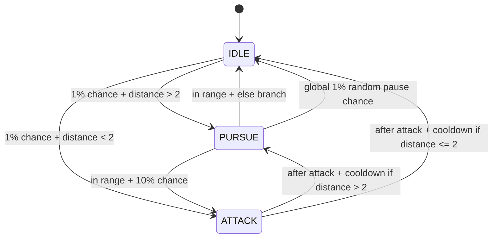

# Enemy AI State Machine - Full Explanation

## Overview
This enemy AI is implemented as a classic finite state machine (FSM) with three states:

- `IDLE`
- `PURSUE`
- `ATTACK`

The runtime owner is `AI`, which stores the current state and calls `Process()` every frame.

## Files and Responsibilities

- `Assets/Scripts/Enemy/States/AI.cs`
- `Assets/Scripts/Enemy/States/State.cs`
- `Assets/Scripts/Enemy/States/Idle.cs`
- `Assets/Scripts/Enemy/States/Pursue.cs`
- `Assets/Scripts/Enemy/States/Attack.cs`

### `AI.cs` (State Machine Controller)
`AI` is the MonoBehaviour that owns and drives the state machine.

Key fields:
- `NavMeshAgent agent`: movement controller
- `Animator anim`: animation interface
- `Transform player`: target
- `State currentState`: active state instance
- `minCooldown`, `maxCooldown`: random delay range used by states
- `attackDuration`: how long attack state waits before deciding next transition

Startup flow:
1. Caches `NavMeshAgent`.
2. Calls `TryResolvePlayer()`:
   - tries tag `Player`
   - fallback object name `Player` or `Namiko`
3. If player exists, creates initial state: `new Idle(...)`.
4. If player not found, logs warning and waits.

Update flow:
1. If `player` is missing, it tries to resolve again and returns early if still null.
2. If `currentState` is null, initializes `Idle`.
3. Runs `currentState = currentState.Process();`.

This means the AI is resilient to spawn-order issues (player created later).

### `State.cs` (Base State Contract)
Defines:
- `STATE` enum: `IDLE`, `PURSUE`, `ATTACK`
- `EVENT` enum: `ENTER`, `UPDATE`, `EXIT`

Core shared state:
- `npc`, `agent`, `anim`, `player`
- cooldown settings
- `nextState`
- `stage` (lifecycle event)

Lifecycle protocol:
- Constructor starts at `stage = ENTER`.
- `Process()` runs:
  1. `Enter()` when `ENTER`
  2. `Update()` when `UPDATE`
  3. on `EXIT`, calls `Exit()` and returns `nextState`
- If not exiting, `Process()` returns `this`.

This is the heart of transitions: each state decides when to set `nextState` and `stage = EXIT`.

## State-by-State Logic

### `Idle.cs`
Purpose: enemy stands still and waits for random transition opportunities.

`Enter()`:
- Stops movement: `agent.isStopped = true`
- resets local transition timer flags

`Update()`:
1. Triggers idle animation: `anim.SetTrigger("Idle")`
2. If `player` is null, returns (safe guard)
3. If already transitioning (`isChangingState == true`):
   - countdown `changeTimer`
   - when timer ends, instantiate next state (`Pursue` or `Attack`), then set `stage = EXIT`
4. If not transitioning:
   - with 1% chance and distance to player `> 2`, queue `PURSUE` after random cooldown
   - else with 1% chance and distance `< 2`, queue `ATTACK` after random cooldown

`Exit()`:
- resets trigger `Idle`

Behavior summary:
- Idle does not transition immediately; it first schedules transitions with a randomized delay.

### `Pursue.cs`
Purpose: enemy is in movement/chase mode.

Constructor:
- sets state name
- ensures movement enabled: `agent.isStopped = false`

`Enter()`:
- resets transition timer flags

`Update()`:
1. Sets walk animation bool: `anim.SetBool("isWalking", true)`
2. If transitioning, counts down and exits to queued state (`Attack` or `Idle`)
3. If not transitioning:
   - If player distance `> 2`:
     - gets checkpoint list from `EnemyDestSingleton.Singleton.Checkpoints`
     - selects nearest checkpoint to enemy
     - `agent.SetDestination(closestCheckpoint.transform.position)`
   - Else (player in near range):
     - 10% chance queue `ATTACK`
     - otherwise queue `IDLE`
     - both with random cooldown
4. Independent 1% chance every update to queue `IDLE` (random pause behavior)

`Exit()`:
- disables walking bool

Important detail:
- Pursue does not directly set destination to player. It follows nearest checkpoint from singleton list.

### `Attack.cs`
Purpose: play one attack, wait for attack duration, then decide next state.

`Enter()`:
- resets all timing and flags:
  - `attackTimer = attackDuration`
  - `hasAttacked = false`

`Update()`:
1. If not attacked yet:
   - triggers attack animation once: `anim.SetTrigger("Attack")`
   - sets `hasAttacked = true`
   - returns
2. Wait phase:
   - countdown `attackTimer`
   - returns until timer reaches zero
3. Decision phase (once):
   - if player distance `> 2`: queue `PURSUE`
   - else queue `IDLE`
   - starts random cooldown timer
4. Transition phase:
   - countdown `changeTimer`
   - on completion instantiate queued state and set `stage = EXIT`

`Exit()`:
- resets attack trigger

Behavior summary:
- Attack is intentionally one-shot per entry, then exits after timed cooldown.

## Transition Graph

All transitions happen as two-step operations:
1. Queue target state and cooldown.
2. After cooldown, instantiate next state and set `stage = EXIT`.

## Timing and Randomness
- `minCooldown` / `maxCooldown`: used across states to randomize delay before state switch.
- `Random.Range(0, 100) < x` is used as a pseudo-probability gate each frame.
  - `x = 1` means about 1% per frame
  - `x = 10` means about 10% per frame

Because this is frame-based probability, behavior depends on frame rate. If you want deterministic rates per second, use timers instead of per-frame random checks.

## Player Resolution and Null Safety
Current safeguards:
- `AI` resolves player on startup and retries each update if missing.
- `Idle` returns early if `player == null`.

Potential extra hardening you may consider:
- Add the same `player == null` guard in `Pursue` and `Attack` before distance checks.

## Animator Contract
Expected animator parameters/triggers used by states:
- Trigger: `Idle`
- Bool: `isWalking`
- Trigger: `Attack`

If any name mismatches in Animator Controller, transitions/animations will fail silently or behave unexpectedly.

## Navigation Contract
- Requires a valid `NavMeshAgent` on the same enemy object.
- Requires `EnemyDestSingleton.Singleton.Checkpoints` to exist and contain at least one checkpoint for pursue movement.

## End-to-End Runtime Example
1. Enemy starts in `Idle`.
2. Random check in idle passes, player far, queues `Pursue` with random cooldown.
3. Timer finishes, `Idle` exits, `Pursue` instance becomes current.
4. Pursue sets nearest checkpoint destination and walks.
5. Player gets close, pursue queues `Attack`.
6. Attack triggers once, waits `attackDuration`, then chooses `Idle` or `Pursue` based on distance.
7. Loop continues.

## Quick Debug Checklist
- Enemy never moves:
  - Check `NavMeshAgent` exists and NavMesh baked.
  - Check checkpoint singleton list is populated.
- Enemy never attacks:
  - Check distance threshold (`2`) and random chance conditions.
- Null reference on player:
  - Confirm player tagged `Player` or named `Player`/`Namiko`, or assign manually.
- Animation not playing:
  - Verify Animator parameter names exactly match code.
